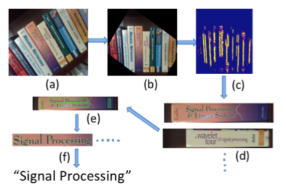
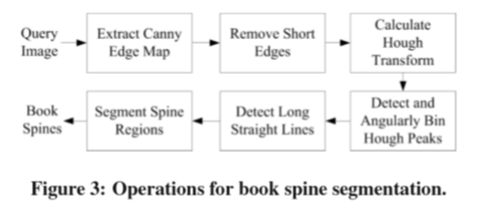
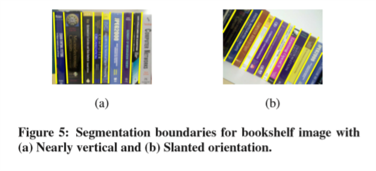
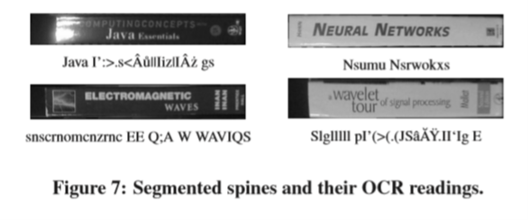

# Smart Library
> Library Inventory Building
>
> Retrieval System

## Table of Contents

- [Introduction](#introduction)
- [Ideas](#ideas)
- [Book Spine Segmentation](#book-spine-segmentation)
  - [First Approach (Low-level Feature Based)](#first-approach-low-level-feature-based)
  - [Second Approach (CNN Based)](#second-approach-cnn-based)
- [Book Retrieval](#book-retrieval)
  - [Image Feature-based Retrieval (Book Spine Matching)](#1-image-feature-based-retrieval-book-spine-matching)
  - [Text-based Retrieval (Text Recognition)](#2-text-based-retrieval-text-recognition)
    - [Text Localization](#21-text-localization)
    - [Text Recognition](#22-text-recognition)
    - [Text Search](#23-text-search)
  - [Combining both the Results](#combining-both-the-results)
- [Location Tracker](#location-tracker)
- [Experiments](#experiments)

## Introduction
- Managing books in a large bookshelf and finding books on it often leads to tedious manual work, especially for large book collections where books might be missing or misplaced.
- Deployment of barcode and radio-frequency identification (RFID) management systems is costly and affordable only to large institutions and it requires physically attaching a marker to each book.
- Manually searching bookshelves is time-consuming and often not fruitful depending on how vague the search is.
-  The intent of this system is to make what was previously a tedious experience (i.e., searching books in bookshelves) much more user-friendly.
- Recently, deep neural models, such as Convolutional Neural Networks (CNN) and Recurrent Neural Networks (RNN) have achieved great success for scene text detection and recognition.
- Our system has two goals:
  1. Build a book inventory from only the images of bookshelves.
  2. Help users quickly locate the book they are looking for.

## Ideas
- After spine recognition, the user can select individual spines in the phone’s viewfinder to obtain more information about a particular book, without ever having to take that book off the bookshelf.
- Use the digital compass and accelerometer on the smartphone to estimate location of the identified books. The digital compass tells us which direction the phone is facing when a book is photographed, while a temporal trace of the accelerometer informs us how far vertically and horizontally the phone has moved from the last anchor point.
- Once the book is identified, additional stored information could also be retrieved, e.g. a short description of the book.
- Indexing and searching from a book database.
- Find the location of books on the bookshelves.
- Use online amazon database to store recognized data and fetch data.
- Make a database of images of book spine for every book and then use some image similarity measures between images, already stored in database and taken from a camera.
- Can use string pattern matching for correcting book names. For it, we have to make a book database containing all books name OR use spelling correction or nearest Levenshtein distance matching against a dictionary to correct spellings.

# Book Spine Segmentation
Book spine segmentation is a critical component of our system since each book is expected to be recognized, stored, and queried independently.
Recognizing book spines in a photo of a bookshelf is very challenging because each spine has a small surface area containing few image features and the other spines’ image features act as clutter in feature-based image matching.

## First Approach (Low-level Feature Based)

- First, a Canny edge map is extracted from the query image. In the Canny edge map, the crevices between book spines appear as long and straight edges, while the text and graphics on the spines appear as short and curved edges.
- Connected components are detected in the edge map, and all components containing fewer pixels than a lower threshold are removed.
- Next, a Hough transform is calculated from the edge map with short edges removed. It is found that removal of short edges improves the resolution of peaks in the Hough transform.
- To estimate the dominant angle θspines of the spines, the Hough peak occurrences are binned in an angular histogram. The bin attaining the highest count in the angular histogram yields the spines’ dominant angle θspines.
- Given the dominant angle θspines of the book spines, we search for long straight lines with angle near θspines. Long straight lines can be detected from the Canny edge map.

## Second Approach (CNN Based)
Performance of most existing approaches is limited by book spine segmentation. Hand-craft features based book spine segmentation suffers from common image distortion and low contrast between books.
- Use Hough Transform as a pre-processing step to extract the dominant direction of books in the image.
- Dominant direction is then used to rotate the entire image.
- Then apply a text/non-text CNN model trained on 32×64 color image patches to generate saliency maps of the rotated image.
- The saliency images could be further used in the following ways:
  1. Extract the book title location
  2. Segment each book.
- Use non-max suppression to find the segmenting point of each book along the vertical axis.
- Here, we circumvent the need for book spine segmentation methods based on the Hough Transform or other low-level routines, which can be easily influenced by lighting conditions or low contrast between books.

# Book Retrieval
Two approaches -
1. Image feature-based recognition pipeline - The image features of the book spine image are searched through a book spine image database.
2. Text-based recognition pipeline - The text within the book spine image is recognized and used as keywords to search a book spine text database.

## 1. Image Feature-based Retrieval (Book Spine Matching)
- Each of the segmented spines is individually matched against a database of book spines.
- First, a set of scale and rotation-invariant features, or a bag-of-visual-features (BoVF), are extracted from each query spine.
- Since achieving low query latency is very important for interactive book searches, we employ SURF features, which are much faster to compute than and offer comparable performance to SIFT features.

- SURF features are extracted from each database spine image. The set of all database features is used to train a vocabulary tree with 6 levels and 106 leaf nodes.
- For fast search through a large database of book spines, each query spine’s BoVF is quantized through a vocabulary tree. Soft binning is used to mitigate quantization errors.
- The quantized BoVF of the query spine forms a tree histogram, counting how often each node in the vocabulary tree has been visited.
- A similarity score between the query tree histogram and each database tree histogram is computed by histogram intersection, which can be performed efficiently using an inverted index.
- Thereafter, a shortlist of the 50 top-ranked database spines are further subjected to rigorous pairwise geometric verification using the ratio test and affine model RANSAC to find spatial consistency between the feature matches.
- The best matching database spine is then selected.

[//]: # (Construct a vocabulary tree using SURF features extracted from the database book spine images.
From the query spine, extract SURF features and use them to match the spines to a database of book spine images using a vocabulary tree with soft binning.
A small set of top scoring candidates from the vocabulary tree are geometrically verified by estimating an affine model between the two spine images using RANSAC to find the total number of feature matches.)

## 2. Text-based Retrieval (Text Recognition)
## 2.1 Text Localization
A scene text detection algorithm is applied to each book spine our system obtains. This step detects words on the book spines, which provide detailed and useful information about the book.
For text localization in a library environment, we use a book spine segmentation method based on Hough transform and scene text saliency. A state-of-the-art text localization method is subsequently applied to extract multi-oriented text information on a segmented book spine.
- Use region proposal based method for scene text detection.
- First generate extreme region because of fast computation and high recall.
- Saliency maps generated by the CNN are then used to filter out non-text regions.
- A multi-orientation text line grouping algorithm is applied to find different lines of text - by first constructing a character graph and then aligning character components into text lines.
- Low level features, such as perceptual divergence and aspect ratio, are used to find text components that belong to the same line.
- We need to further decide whether a text line is upside down or not. To address this issue, train a CNN classifier on 32 × 96 image patches.
-  The binary classifier tells us whether we need to flip the text lines in order to provide the text recognition module with a correct sequence.

**Another approach**
- Detect text in the extracted book spine image using a text detection algorithm based on Maximally Stable Extremal Regions (MSER) and Stroke Width Transform (SWT).
-  MSERs are detected from the image and pruned using Canny edges, forming the character candidates.
-   Stroke widths of the character candidates are found based on distance transforms.
-   Then, they are pairwise linked together based on their geometric property to form text lines.
-   The algorithm localizes the text within the book spine image and also filters out graphical components on the book spine. The localized text is then extracted from the book spine image and denoised using an edge-preserving filter. 

## 2.2 Text Recognition
In this system, book spine images are identified based on the recognized text, which are then used as keywords for indexing or searching a book database. During the querying process, system only relies on text information without requiring the original spine images. 

### 2.2.1 OCR Based Approach
- Distortions in real scene images make recognition a very different and challenging task from a standard OCR system.
- OCR system, such as Tesseract (Smith, 2007), perform poorly on image taken of natural scenes.
- Because the spines often contain non-text graphics, uneven illumination, and varying fonts, the OCR engine almost always gives unrecognizable text outputs.

### 2.2.2 Deep Learning Based Approach
Build a deep neural network-based scene text reading system. For text recognition, adopt a deep sequential labeling model based on convolutional and recurrent neural architectures.
Use a per-timestep classification loss in tandem with a revised version of the **Connectionist Temporal Classification (CTC)** (Graves et al., 2006) loss, which accelerates the training process and improves the performance.

#### 2.2.2.1 Text Recognition via Sequence Labeling
- Segmenting and recognizing each character is highly sensitive to various distortions in images, making character level segmentation imperfect and sometimes even impossible.
- So we train a model to recognize a sequence of characters simultaneously.
- Adopt a hybrid approach that combines a CNN with an RNN, casting scene text recognition problem as a sequential labeling task.
-  A CNN at the bottom learns features from the images which are then composed as feature sequences that are subsequently fed into an RNN for sequential labeling.
- A bidirectional Long Short-Term Memory (B-LSTM) model is applied on top of the learned sequential CNN features to exploit the interdependence among features.

#### 2.2.2.2 CTC Loss
- Sequences X (prediction) and Y (target) have different lengths, so we adopt CTC loss to allow an RNN to be trained  for sequence labeling task without exact alignment.
- CTC loss is the negative log likelihood of outputting a target word Y given an input sequence X.
- Stochastic gradient descent (SGD) method is used for optimization.
- Use forward backward dynamic programming method for computation of loss.
- Decoding (finding the most likely Y from the output sequence X) can be done by performing a beam search  or simply by selecting the single most likely prediction at each timestep and then applying the mapping function B.

#### 2.2.2.3 Text Correction
- A post-processing step is necessary to correct the outputs of the recognition model.
- Experiments shows that that a standard spellchecker is not powerful enough for automatic correction, since we need to not only correct individual words, but also break larger strings into words.
- So train another RNN, employing a character-level sequence-to-sequence model.
- The RNN is designed with 2 layers of LSTM, each with a hidden size of 512.
- Both recognition model and correction model is trained using mini-batch stochastic gradient descent (SGD) together with Adadelta (Zeiler, 2012).

## 2.3 Text Search
- Organize the book spine text database using inverted files, commonly used in text retrieval systems.
- Construct a dictionary W using the text on the spines of the book title database.
- From a query book spine image, read a set of query keywords. Use the keywords to search through the database. For each keyword, we find a matching dictionary word. 
- Two approaches to find matching words
  1. Exact word matching
  2. Nearest neighbor word matching
- Use tf-idf (term frequency-inverse document frequency) weighting. tf weights the word according to the number of occurrences within the spine text, and idf weights the score based on the how many different titles the word has occurred in.

## Combining both the Results
- Combine the results of the text-based recognition pipeline with the image feature-based recognition pipeline to form the final result.
-  A linear combination is used to combine them. For the text-based recognition pipeline, calculate score st(k) for database spine k. For the image feature-based recognition pipeline, the score si(k) for database spine k is the number of feature matches after geometric verification.
-  The hybrid score sh(k) for book spine k, is calculated by linearly combining scores from the two pipelines as follows:
`sh(k) = st(k) + λ · si(k)`

## Location Tracker
A location tracking algorithm infers each book’s location, at the time each photo is taken, from the gathered location data. Despite the availability of the smartphone’s sensor measurements, determining the precise location of each book is still challenging because these measurements are often noisy.
- WiFi-based localization only provides 2D location coordinates excluding height, whereas for accurate book localization we require 3D coordinates.
- The location of each book is inferred from the smartphone’s sensor readings, including accelerometer traces, digital compass measurements, and WiFi signatures. This location information is combined with the image recognition results to construct a location-aware book inventory.
- The digital compass tells us which direction the phone is facing when a book is photographed, while a temporal trace of the accelerometer informs us how far vertically and horizontally the phone has moved from the last anchor point.
- Determine the locations of individual books, specifying which room, which bookshelf, and where in the bookshelf each recognized book can be found.

## Experiments
-  During search, use tf-idf (term frequency-inverse document frequency) weights to rank returned results.
-  Build search engine based on Apache Solr so that system scales well to large collection of books.
-  Evaluate results using Reciprocal Rank (RR) which is defined as: RR = 1/K, where K is the rank position of the first relevant document (the target book spine in our case).
-  Average Reciprocal Rank (MRR) across multiple queries should also be reported. All these measures are widely used by the information retrieval community.
-  Spines with text that have generic fonts tend to be harder for the image feature-based system to recognize due to the similarity between visual features. However, character recognition on generic fonts has higher accuracy.
-  On the other hand, spines with graphical components and cursive text are rather challenging to recognize text. In contrast, image features of these spines are fairly distinctive.
-  For text-based spine recognition use NN word matching with the additional tf-idf weighting.
-  Since the book collection contains books with very similar titles, even using groundtruth titles as keywords in search cannot guarantee 100% recall at top-1 rank position.

#### Probelms
-  Wrong predictions due to less discriminative keywords used during search. Multiple books may have very similar or even identical titles.
-  Some meta information on book spine images tends to be blurry and small in size, making detection and recognition more difficult.
  -  Although image-based search might address this issue, it comes with the steep cost of storing and transmitting images.
-  Other failure cases are majorly due to imperfect or even wrong text localization bounding boxes.
